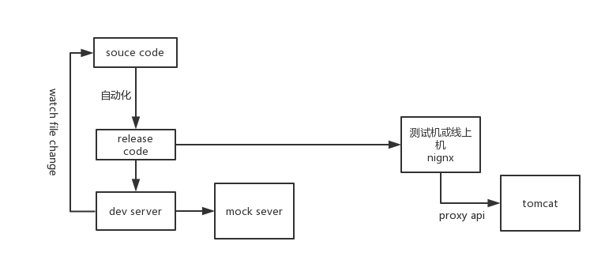

### 前端是在做什么

* 工作内容上 html+ css+ js 

  从编写的代码类型来看，前端的工作内容几乎都是在围绕这3样东西，一般我们去限定任务边界时也经常依据这一套标准。

  虽然现在前端的源代码往往是另一种格式：比如你写html时有可能直接写html而是再用模板引擎，而你的css源代码也或许是less或者sass等预编译语言，你编写的js和真正到浏览器上执行的代码不是一个规范。但是你会发现前端最终输出的内容差不多都离不开html+css+js。

  因为前端最终的“编译器“是浏览器，浏览器只认识这3样东西。

  ```javascript
  template(tpl,ftl) ----> html  // 解决可复用dom维护问题
  less/sass/stylus ------> css   // 解决css编写过程中函数，变量，嵌套的一些问题
  es6 -----> es5(ie8)        // 最新的规范受浏览器的发展影响
  ```

  ​

  > 在技术架构里不足以划分任务边界

  ​

* 表现层

  前端相较于后端而言，在传统的MVC软件架构里，前端可以理解成表现层View。

  

  ​

  表现层是和用户接触最近的，主要负责界面的视觉和用户交互，用户可以直接看到的，以及用户所能触达的交互行为相关的事情都是表现层要处理的事情。

  而前端工作内容就是在处理表现层的内容。

  > 大前端


###  前后端分离

什么是前后端分离：就是将表现层和业务逻辑层彻底的分离开，已达到独立工程化的程度。

#### 为什么分离

> 前提： 富交互化app盛行, 更多的动画效果，复杂的交互逻辑，统一的组件管理，H5 更多的API等等。前端要考虑的内容变得没有那么简单了。

* 关注点分离，更适合技术角色分化，顺应社会化分工，每个人专注做自己最擅长的事情是高效率的保证。
* 前端和后端在开发阶段脱离硬依赖关系，从统筹规划的角度，考虑可以将部分串行流水线变成并行流水线，缩短迭代周期。
* 可实现server对接多终端，server api更方便的做技术选型和架构切换
* 项目系统代码的解耦，方便分而治之。满足表现层和业务逻辑层的迭代频率不一致
* 数据逻辑和表现逻辑混杂不清的情况得以有效处理


时间戳，百分比，图谱

之于前端而言，前后端分离带来的不只是当方面的好处，而是更多的可能性。

当然前后端分离的场景是依据项目工程的大小来定，如果没有上面的前提条件，前后端分离也就是一个形式而已了。


### 如何做前后端分离

如果站在将表现层和逻辑层分离的角度，架构里本来就是V和C分开的，只不过关注点没有分工。我们现在要做的就是将关注点分离，把模板层交给前端人员处理，并且将前后端code分割开做各自的工程化。在这个过程中，前后端通过Ajax调用restful api的形式进行数据通信。


我们首先要处理的问题是

* 前后端code分割，其实没有强制性分离的理由，但前端脱离后端是本地调试和工程化的前提。

* 前端负责将设计还原，用户交互，数据展现。后端负责处理数据逻辑并提供restful api
* 通信协议

> 使用json数据格式，在http协议上层添加逻辑处理通信协议{code:200,msg:'',data:''}


接下来要解决的问题

* 接口数据格式协商的问题

  > 前后端的唯一交集就是接口，所以前后端的沟通成本也就全部放在了接口协商上。每个API的数据格式是双方协商定义的，之后根据协定的接口文档进行并行开发，一般是上游给下游提供接口文档，下游确认上游接口文档的形式。当确认好后数据格式基本保持不变，当有变动时要再走一遍协商过程。

* 并行开发，环境隔离的问题

  > 当接口协商完成，后端即可根据结果导向进行开发，前端可以根据接口文档进行mock数据，本地搭建mock server，进行环境隔离的并行开发。在双方并行的过程中极有可能会出现缺少字段的问题，这种情况基本在并行开发阶段就解决掉。但是大的数据结构的变化要尽量避免。

* 联调的问题

  > 当前后端隔离开发完毕后，会有一个联调阶段。可以将前后端代码都发布到一台机器上进行前后端自测，看功能性有没有问题。也可后端提供可访问的接口地址，前端本地代理联调。因为前端发布代码是不方便调试的，所以前端需要在本地搭建一个node代理进行进行源代码调试测试环境和线上环境的真实数据。

  

* 部署和测试的问题

  > 将release code 放到测试容器或线上容器即可，一般使用自动化部署jenkins 拉去代码，执行打包压缩，然后将打包好的code copy到制定机器即可。

```nginx
server {
    listen 80;
    server_name your.domain.name;
    location / {
        proxy_pass http://localhost:5000/;
    }

    location /api/ {
        proxy_pass http://localhost:8080/service/;    
    }
}  
```


做了这一步之后

后端要做的事：不再处理模板渲染，根据业务逻辑规划api分布，维护每个api服务的版本，确定每个api的入参出参，做好数据逻辑计算以及数据的CURD，必要时做缓存处理，做日志记录，做必要的验证以确保安全性。

前端要做的事：完整的理解产品的呈现形式和交互逻辑。合理输出HTML，css，js用以呈现结构化数据，辅助表现形式以及丰富的用户交互。合理分割UI组件，以最大化复用率提高复用率。使用必要的工具来提高前端开发效率和降低维护成本，在前端项目复杂化时做好工程化。


在下一步，前端以前不用解决，现在要解决的问题

* 应用路由的问题
* 应用状态的维护
* 前端代码可复用，以降低维护成本


#### 方案1

重点在分离，不在提高效率

使用纯html，css，js编写前端，source code 到release code 只做合并和压缩，不做转码，不做加载机制处理。

* http-server 做dev server 
* 使用mock.js 做ajax请求的拦截进行mock数据
* 通过文件的目录结构做路由地址。

具体见 D:\code\fe\plan1

本地开发时 `npm run dev`

测试发布时把源代码copy到制定服务器就可以了


#### 方案2

在方案1的基础上解决代码复用，提高前端开发效率的问题

* html代码的可复用，引用模板引擎

  mustache,handlebars,arttemplate / jade(pug),ejs,swig 

  freemarker（查看文沥实例）

  https://github.com/ijse/gulp-freemarker

  https://github.com/ijse/freemarker.js


* 使用css预处理器，sass，less

  >  http://lesscss.cn/

* 使用js模块加载器,解决js代码量剧增，需要分模块管理的问题，实质上解决js命名空间冲突的问题sea.js

  > https://github.com/seajs/seajs

现在需要考虑source 到release的自动化，我们使用gulp 做自动化构建

自动化构建要处理的内容

 * less/sass ->css
* template -> html
* 静态资源的合并压缩
* 静态资源版本号后缀


#### 方案3

回头看刚才要解决的问题，路由方案没有很好的解决因为没有控制器的概念，前端很难做路由；代码可复用的问题得到了 一定程度度的解决，但还没有按组件划分；应用状态问题只能通过本地存储解决。

所以我们引入程度的框架来解决我们的问题。

backbone ——>angular ——>react/vue

* react/vue 的组件规范都是基于web components 规范制定的，可以合理的完成组件的复用，嵌套等场景
* mvvm模式可以很好的处理model和view之间的绑定关系，实现数据双向绑定，利用virtual dom diff算法达到最优化性能提升
* 有完整的生态，可以配备vue-router解决路由问题，可以结合vuex做应用状态管理。
* 可以结合webpack进行打包和babel转码，以及预编译的自动化过程。


我们使用vue该怎么做？

* node version8+

  >https://shangxinbo.github.io/blog/node_release_plan.html
  >
  >node 8 内置npm5，我们使用的其实是npm5的包管理功能

* 使用自动化创建项目脚手架 vue-cli

``` bash
npm install vue-cli -g
vue init webpack my-project
cd my-project
npm install
npm run dev
```

* 我们要是用的自动化脚本

```javascript
"dev": "webpack-dev-server --inline --progress --config build/webpack.dev.conf.js",
"start": "npm run dev",
"proxy": "node run dev --proxy",
"unit": "jest --config test/unit/jest.conf.js --coverage",
"test": "npm run unit",
"lint": "eslint --ext .js,.vue src test/unit",
"build": "node build/build.js"
```

* 目录分布及相关作用

>  D:\code\myproject

* 开发具体问题讲解
  * 组件的格式vue
  * 入口文件
  * 路由设置
  * 引入外部库的问题，比如引入jQuery
  * 组件的嵌套和包含
  * 同组件使用相同数据 ,父子组件传值
  * 图片的引入，万物皆js
  * router link的编写
* 联调流程

当前后端开发完毕之后，我们需要联调，联调的作用是将不同的系统部分组合在一起，形成一体，这是分离的必要阶段

理想状态是完美插拔。但一般情况不能达到理想状态。所以一般联调阶段是需要耗费时间进行齿轮的吻合过程。

我们的原则是，尽量在并行阶段进行完善的自测，以缩短联调时间，一种不健康的开发模式是，联调双方还没有开发完成就进入联调，这样往往会影响双方的计划时间，并浪费专注开发时间，一些方案会出现摇摆不定的情况。

联调不是单纯的下游验证上游的过程。

前端后端联调，需要一台可同时做code runtime的机器，我们一般会放到测试环境，在这个环境里，前后端代码整合在一起，前后端一起验证功能是否完善，联调测试是提测前必要的阶段。

联调阶段，前端本地调试真实接口使用node 做代理切换，讲mock接口换成真实环境接口。

```bash
npm run proxy
```

* 自动化部署

  * 使用jenkins  git pull 
  * jenkins 执行 npm run build 
  * jenkins 将dist/* 文件发布到目标机器
  * 注意每次初始化时，或者有新依赖加入时要在build 前进行npm install 依赖下载

* git 工作流的问题

  develop   测试环境

  master    预发环境

  online     线上环境

  feature/XXX   功能分支

  hotfix/XXX     bug 分支


分支的纯净度  develop -> master -> online 

每次新feature或bugfix ，从online创建一个新分支，然后依次merge到develop->master->online


* 兼容问题

  vue 的核心原理是es5 的object.defineProperty()方法，该属性最低ie兼容是IE9。

  ​

实战问题：

用户认证的问题

角色权限问题

接口验证问题